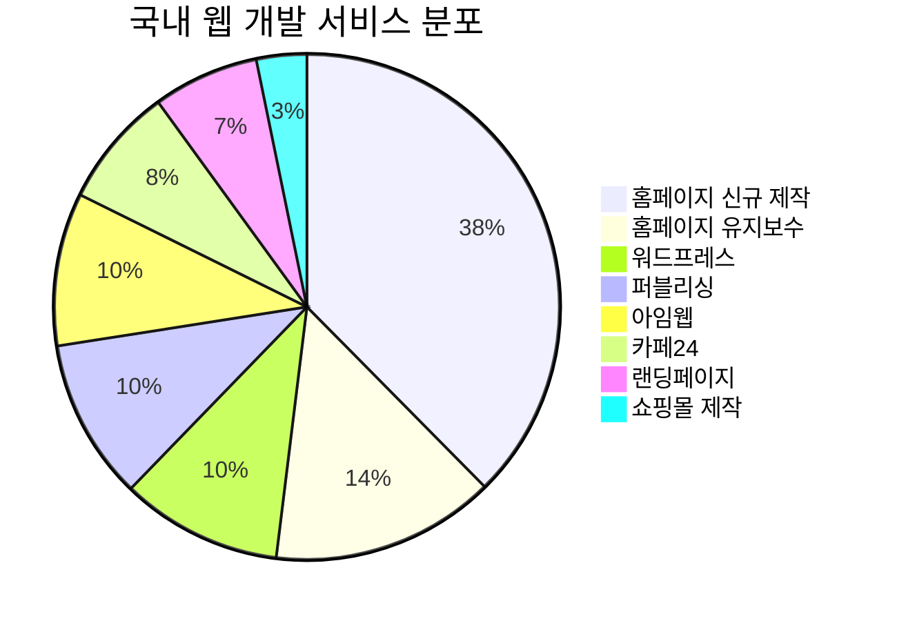

# IT 프리랜서 서비스 시장 심층 분석 보고서

> **분석일**: 2026-03-09 **분석 범위**: 국내 프리랜서 마켓플레이스(크몽 중심) + Fiverr (글로벌) **대상 카테고리**: IT·프로그래밍 전체

---

## 1. 시장 개요

### 글로벌 프리랜서 플랫폼 시장 규모

| 지표 | 수치 |
| --- | --- |
| 2026년 시장 규모 | **$8.9B** (약 11.6조원) |
| 2031년 예상 규모 | **$21.97B** (약 28.6조원) |
| 연평균 성장률 (CAGR) | **16.32%** |
| AI 도구 활용 프리랜서 비율 | **84%** (2026년 기준) |

---

## 2. 국내 IT 프리랜서 서비스 현황 (크몽 중심)

### 2.1 크몽 플랫폼 개요

| 지표 | 수치 |
| --- | --- |
| 누적 회원 수 | **455만 명** |
| 등록 전문가 수 | **30만 명+** |
| 서비스 카테고리 | **600개+** |
| 총 서비스 수 | **33만 개+** |
| 상위 10% 월평균 수익 | **663만 원** |
| 첫 판매까지 소요 시간 | **2주 이내** |
| 플랫폼 수수료 | **20%** (등급에 따라 최대 5% 할인) |

**주요 고객사**: KB그룹, 넥슨, 포스코, 카카오, 현대차, SK텔레콤, 셀렉토커피, 메가스터디 등

### 2.2 크몽 엔터프라이즈 (B2B)

| 지표 | 수치 |
| --- | --- |
| 2024년 상반기 계약 실적 | **100억 원+** |
| 전년 동기 대비 성장률 | **60%** |
| IT 개발 프로젝트 비중 | **50%+** |
| 디자인/영상 제작 비중 | 각 **20%** |
| 단일 최대 거래액 | **12억 원** |
| 전문가 매칭 소요 시간 | **4일 이내** |
| 검증된 상위 전문가 비율 | **상위 5%** |

### 2.3 IT·프로그래밍 카테고리 전체 규모

- IT·프로그래밍 카테고리 총 서비스 수: **15,439개**
- 세부 카테고리: **57개+**

### 2.4 인기 카테고리 TOP 5

| 순위 | 카테고리 | 서비스 수 | 비중 |
| --- | --- | --- | --- |
| 1 | **홈페이지 신규 제작** | 2,195 | 14.2% |
| 2 | **모바일 앱 개발** | 947 | 6.1% |
| 3 | **업무 자동화** | 870 | 5.6% |
| 4 | **일반 프로그램 개발** | 869 | 5.6% |
| 5 | **홈페이지 수정·유지보수** | 838 | 5.4% |

### 2.5 카테고리 그룹별 서비스 분포

#### 웹빌더 플랫폼

| 카테고리 | 서비스 수 |
| --- | --- |
| 워드프레스 | 602 |
| 아임웹 | 571 |
| 카페24 | 449 |
| 쇼피파이 | \- |
| 윅스(Wix) | \- |
| 노션 | \- |

#### 웹 제작·유지보수

| 카테고리 | 서비스 수 |
| --- | --- |
| 홈페이지 신규 제작 | 2,195 |
| 홈페이지 수정·유지보수 | 838 |
| 퍼블리싱 | 600 |
| 랜딩페이지 | 396 |
| 쇼핑몰 신규 제작 | 188 |

#### 프로그램 개발

| 카테고리 | 서비스 수 |
| --- | --- |
| 업무 자동화 | 870 |
| 일반 프로그램 | 869 |
| 크롤링·스크래핑 | 596 |
| 서버·클우드 | 536 |
| 수익 자동화 | 393 |
| 엑셀·스프레드시트 | 261 |
| 봇·챗봇 | 196 |

#### 모바일 앱

| 카테고리 | 서비스 수 |
| --- | --- |
| 앱 개발 (신규) | 947 |
| 앱 수정·유지보수 | 151 |

#### AI 서비스 (신흥)

| 카테고리 | 서비스 수 |
| --- | --- |
| AI 자동화 프로그램 | 238 |
| AI 시스템·서비스 | 189 |
| 맞춤형 챗봇·GPT | 108 |
| AI 에이전트 | 47 |
| AI 기능 개발·연동 | 35 |
| AI 데이터 분석 | \- |
| AI 도입 컨설팅 | \- |

#### 기타 전문 분야

| 카테고리 | 서비스 수 |
| --- | --- |
| 블록체인·NFT | 347 |
| 게임·AR·VR | 328 |
| 서비스·MVP 개발 | 305 |
| UI·UX 기획 | 243 |
| 백엔드 | 160 |
| 정보 보안 | 131 |
| 프론트엔드 | 116 |
| 데이터 구매·구축 | 44 |

### 2.6 국내 가격대 분석 (크몽 기준)

| 서비스 유형 | 가격 범위 | 평균 가격 |
| --- | --- | --- |
| 홈페이지 신규 제작 | 15만원 \~ 320만원+ | 50\~150만원 |
| 반응형 홈페이지 | 28만원 \~ 132만원 | 60만원 |
| 모바일 앱 개발 | 175만원 \~ 500만원+ | 300만원 |
| 플러터 앱 개발 | 3만원 \~ 500만원+ | 150만원 |
| React Native 앱 | 175만원 \~ 220만원+ | 200만원 |
| 워드프레스 사이트 | 66만원+ | 80만원 |
| 쇼핑몰 제작·운영 | 100만원+ | 200만원 |
| 웹 크롤링 | 0.9만원 \~ 20만원+ | 5만원 |
| 퍼블리싱 (코딩) | 2.2만원+ | 10만원 |
| React 프론트엔드 | 5만원+ | 30만원 |
| GA4·애널리틱스 | 9만원+ | 20만원 |
| PHP/그누보드 수정 | 3.5만원+ | 15만원 |
| 기획/디자인/개발 통합 | 310만원+ | 500만원 |

### 2.7 크몽 프리랜서 등급 체계

| 등급 | 조건 | 혜택 |
| --- | --- | --- |
| **NEW** | 신규 가입 | 기본 노출 |
| **LEVEL 1** | 일정 판매량 달성 | 검색 우선 노출 |
| **LEVEL 2** | 높은 판매량 + 평점 | 상위 노출 + 배지 |
| **TOP** | 우수 판매 실적 | 최상위 노출 + 인증 마크 |
| **마스터** | 최상위 전문가 | 프리미엄 배지 + 전담 매니저 |
| **어워즈** | 특정 분야 최고 | 연간 시상 + 특별 혜택 |

---

## 3. Fiverr (글로벌) IT 서비스 현황

### 3.1 Fiverr 플랫폼 개요

| 지표 | 수치 |
| --- | --- |
| 런칭 | 2010년 2월 (이스라엘 텔아비브) |
| 활성 구매자 수 | **380만 명** (2024년 기준) |
| 활성 판매자 수 | **38만 명** |
| 서비스 카테고리 | **700개+** |
| 월 방문자 수 | **8,041만 명** |
| 2024년 Q3 매출 | **$9,960만** (YoY +8%) |
| 구매자당 평균 지출 | **$296** (YoY +9%) |
| 플랫폼 수수료 | **20%** (판매자) + **5.5%** (구매자) |
| 미국 기반 매출 비중 | **50%+** |
| NPS (추천 지수) | **79/100** |

### 3.2 Fiverr 방문자-구매 전환률

| 지표 | 수치 |
| --- | --- |
| 방문자-리드 전환률 | **27.1%** (4명 중 1명 구매) |
| 미국 트래픽 비중 | **21.67%** |
| 검색 유입 비중 | **19.6%** |
| 소셜 미디어 유입 | **6.28%** |
| 반복 구매 비중 | **65%** (코어 매출) |

### 3.3 Programming & Tech 카테고리 전체 규모

- Programming & Tech 세부 카테고리: **550개+**
- 전 세계 프리랜서 플랫폼 중 최대 규모
- 연간 처리 거래: **300만 건+**

### 3.4 메인 카테고리 구성

| \# | 카테고리 | 인기도 | 성장 추세 |
| --- | --- | --- | --- |
| 1 | **Website Development** | ★★★★★ | 안정적 최고 수요 |
| 2 | **AI Coding & Development** | ★★★★★ | **+1,847% 폭발 성장** |
| 3 | **Software Development** | ★★★★☆ | 안정적 핵심 수요 |
| 4 | **Mobile App Development** | ★★★★☆ | 최고 단가 카테고리 |
| 5 | **Chatbots** | ★★★★☆ | AI 챗봇 중심 상승 |
| 6 | **Data / Data Science** | ★★★☆☆ | ML/AI와 함께 성장 |
| 7 | **Cybersecurity** | ★★★☆☆ | **+612% 성장** |
| 8 | **Game Development** | ★★★☆☆ | 안정적 니치 수요 |
| 9 | **Cloud Computing** | ★★★☆☆ | 엔터프라이즈 성장 |
| 10 | **DevOps Engineering** | ★★★☆☆ | IaC/CI·CD 중심 |
| 11 | **Blockchain & Crypto** | ★★☆☆☆ | 니치 |
| 12 | **QA & Testing** | ★★☆☆☆ | 안정적 |
| 13 | **Electronics Engineering** | ★★☆☆☆ | 하드웨어 니치 |
| 14 | **Support & IT** | ★★☆☆☆ | 유지보수 중심 |
| 15 | **Online Coding Lessons** | ★★☆☆☆ | Python/Java 교육 |

### 3.5 Fiverr AI 서비스 급성장 현황

| AI 관련 지표 | 수치 |
| --- | --- |
| "AI consultant" 검색 증가율 | **+650%** (2023년 1월\~7월) |
| AI 프로젝트 검색량 | 폭발적 증가 |
| AI 컨설턴트 평균 요금 | **$1,000/10시간** |
| AI 개발 서비스 수 | **36,508개+** |
| AI 웹 개발 서비스 수 | **33,938개+** |

### 3.6 Fiverr 세부 카테고리 구조

#### Website Development

- WordPress Development
- Shopify Development
- Wix Development
- Webflow Development
- E-Commerce Development
- Custom Website Design
- Landing Page Design
- Other Builders Development

#### AI Coding & Development

- AI Applications / Mobile Apps
- AI Website & Software Development
- AI Integrations
- Custom GPT Apps
- AI Technology Consulting

#### Software Development

- Web Applications
- API Integrations
- Automations & Workflows
- Help & Consultation

#### Mobile App Development

- iOS App Development
- Android App Development
- Cross-Platform Apps (Flutter, React Native)
- UI/UX for Mobile

#### Data & Analytics

- Data Science & Machine Learning
- Data Analysis / Business Intelligence
- Data Visualization
- Algorithm Development
- Manual Data Capturing

#### Game Development

- Unity Game Development
- 2D / 3D Game Development
- AR/VR Game Development
- Educational Games

#### Blockchain & Cryptocurrency

- Smart Contracts
- E-Wallet Development
- Coin Design & Tokenization
- Exchange Platforms

### 3.7 Fiverr 가격대 분석

| 서비스 유형 | 기본 (Basic) | 중급 (Standard) | 프리미엄 (Premium) | 평균 프로젝트 비용 |
| --- | --- | --- | --- | --- |
| Website Development | $175 \~ $1,000 | $1,500 \~ $10,000 | $10,000 \~ $100,000+ | $2,500 |
| Web Development (시간당) | $20/hr | $50 \~ $100/hr | $150 \~ $200+/hr | $75/hr |
| Mobile App Development | $5 \~ (간단) | $25 \~ $150/hr | 수천 달러+ | **$508.10** |
| **AI Development (시간당)** | **$150/hr** | **$200 \~ $250/hr** | **$300 \~ $350/hr** | **$250/hr** |
| **AI Development (프로젝트)** | **$5,000** | **$50K \~ $150K** | **$350K \~ $500K+** | **$50,000+** |
| Software Development | $20/hr | $50 \~ $200/hr | $200 \~ $400/hr | $100/hr |
| Fiverr Pro 등급 | $75/hr | $100 \~ $150/hr | $200+/hr | $150/hr |
| App Maintenance | \- | \- | \- | **$25/건** |
| App Design | \- | \- | \- | **$20/건** |

> **참고**: Fiverr 수수료 — 전체 주문의 5.5% + $50 미만 소규모 주문 시 $3 추가

### 3.8 Fiverr 판매자 등급 체계

| 등급 | 조건 | 특징 |
| --- | --- | --- |
| **New Seller** | 신규 가입 | 기본 기능 |
| **Level 1** | 30일+, 10건+ 완료, $400+ 매출 | 추가 기능 |
| **Level 2** | 90일+, 50건+ 완료, $2,000+ 매출 | 우선 지원 |
| **Top Rated** | 180일+, 100건+ 완료, $20,000+ 매출, 수동 선정 | 최고 등급 |
| **Fiverr Pro** | 엄격한 심사 통과 | 프리미엄 가격, 기업 고객 대상 |
| **Vetted Pro** | 검증된 에이전시/전문가 | 최상위 품질 보장 |

### 3.9 Fiverr Pro 특징

- 엄격한 검증 절차 통과한 상위 전문가
- 평균 시급 **$150\~$350**
- 기업 고객(B2B) 대상 프리미엄 서비스
- Fiverr의 직접 품질 보증
- 고급 프로젝트 매칭 우선권

---

## 4. 크로스 플랫폼 비교 분석

### 4.1 플랫폼 기본 정보 비교

| 비교 항목 | 크몽 (국내) | Fiverr (글로벌) |
| --- | --- | --- |
| **설립 연도** | 2012년 | 2010년 |
| **본사 위치** | 서울, 한국 | 텔아비브, 이스라엘 |
| **회원 수** | 455만 명 | 3,800만+ (누적) |
| **활성 구매자** | 200만+ | 380만 |
| **활성 판매자** | 30만+ | 38만 |
| **서비스 카테고리** | 600개+ | 700개+ |
| **IT 서비스 수** | 15,439개 | 550개+ 카테고리 |
| **플랫폼 수수료** | 20% | 20% (판매자) |
| **구매자 수수료** | 없음 | 5.5% + $3 |
| **가격 표시** | 원화 (고정가) | USD (패키지 3단계) |
| **주요 고객** | 중소기업, 대기업 | 글로벌 기업, 스타트업 |

### 4.2 카테고리 구조 비교

| 비교 항목 | 크몽 | Fiverr |
| --- | --- | --- |
| IT 전체 서비스 수 | 15,439개 | 550개+ 카테고리 |
| 메인 카테고리 | 10개 그룹 | 15개+ 메인 |
| 세부 카테고리 | 57개+ | 550개+ |
| AI 전용 카테고리 | 7개 (신설) | 5개+ (급성장) |
| 프리랜서 등급 | 마스터, 어워즈 | New → Level 1/2 → Top → Pro |

### 4.3 인기 서비스 순위 비교

| 순위 | 크몽 (국내) | Fiverr |
| --- | --- | --- |
| 1 | 홈페이지 신규 제작 | Website Development |
| 2 | 모바일 앱 개발 | AI Coding & Development |
| 3 | 업무 자동화 | Software Development |
| 4 | 일반 프로그램 | Mobile App Development |
| 5 | 홈페이지 유지보수 | Chatbots (AI) |

### 4.4 핵심 차이점

| 관점 | 크몽 | Fiverr |
| --- | --- | --- |
| **최대 수요** | 홈페이지 제작 (14.2%) | Website Development |
| **AI 비중** | 낮음 (AI 서비스 합산 \~4%) | 높음 (AI 최고 성장률 1위) |
| **웹빌더 점유율** | 워드프레스 &gt; 아임웹 &gt; 카페24 | WordPress &gt; Shopify &gt; Webflow |
| **수익자동화/크롤링** | 매우 활발 (국내 특화) | 상대적으로 적음 |
| **단가 수준** | 15만\~500만원 (대부분) | $175 \~ $100,000+ (편차 큼) |
| **No-Code/Low-Code** | 카테고리 미분리 | 독립 카테고리 (+934% 성장) |
| **사이버보안** | 131개 서비스 (소규모) | +612% 성장 (글로벌 트렌드) |
| **B2B 서비스** | 크몽 엔터프라이즈 (100억+) | Fiverr Business, Pro |
| **기업 고객** | KB, 카카오, 현대차 등 | 포춘 500 기업 48% 이용 |

### 4.5 프리랜서 수익 비교

| 항목 | 크몽 | Fiverr |
| --- | --- | --- |
| **상위 10% 월평균 수익** | 663만 원 | $3,000\~$5,000+ |
| **최고 수익 사례** | 누적 6억 원+ | 연간 $100,000+ |
| **재구매율** | 80% (우수 판매자) | 65% (전체) |
| **평균 프로젝트 단가** | 50\~150만원 | $296 |
| **초보자 진입 장벽** | 중간 | 낮음 |

---

## 5. 트렌드 분석: 뜨는 서비스 vs 지는 서비스

### 5.1 급성장 서비스 (Rising)

```
📈 폭발적 성장
```

| 서비스 | 성장률 | 설명 |
| --- | --- | --- |
| **AI 코딩 & 개발** | +1,847% | AI 앱, AI SaaS, 커스텀 GPT 앱 |
| **No-Code/Low-Code** | +934% | 비개발자 대상 앱 빌딩 가속화 |
| **사이버보안** | +612% | 기업 보안 수요 급증 |
| **AI 자동화** | 급성장 | 업무 프로세스 AI 자동화 |
| **AI 에이전트** | 신규 | 자율 AI 에이전트 구축 수요 |
| **AI 챗봇/GPT** | 급성장 | 커스텀 챗봇, RAG 기반 서비스 |
| **바이브 코딩** | 신규 | AI 보조 코딩, 프롬프트 기반 개발 |
| **AI 컨설팅** | +650% | 기업 AI 도입 컨설팅 수요 |

### 5.2 안정 성장 서비스 (Steady)

| 서비스 | 상태 | 설명 |
| --- | --- | --- |
| 홈페이지 제작 | 안정 최고 수요 | 여전히 1위, 반응형 중심 |
| 모바일 앱 개발 | 안정 고단가 | Flutter/React Native 크로스플랫폼 주도 |
|  | 안정 성장 | RPA + AI 결합 트렌드 |
| 크롤링·스크래핑 | 안정 | 데이터 수집 지속 수요 |
| 클라우드·DevOps | 성장 | IaC, 컨테이너화 수요 증가 |
| MVP·서비스 개발 | 성장 | 스타트업 린 개발 수요 |

### 5.3 하락/포화 서비스 (Declining)

```
📉 하락 추세
```

| 서비스 | 하락륡 | 원인 |
| --- | --- | --- |
| **전통 데이터 입력** | \-43% | AI 자동화로 대체 |
| **기본 그래픽 디자인** | \-28% | AI 이미지 생성 도구 대체 |
| **일반 카피라이팅** | \-19% | LLM 기반 콘텐츠 생성 |
| **수동 테스팅** | 감소 | 자동화 테스트로 전환 |
| **단순 퍼블리싱** | 정체 | 웹빌더/AI 코딩 대체 |
| **블록체인/NFT** | 하락 | 2022년 피크 후 안정화 |

---

## 6. 서비스 분야별 심층 분석

### 6.1 웹 개발 (최대 시장)

**시장 점유율**: 국내 플랫폼 전체의 약 30%+



**주요 트렌드**:

- 반응형(Responsive) 웹은 기본 요건으로 자리잡음
- 웹빌더 플랫폼 중 워드프레스가 국내외 모두 1위
- Fiverr에서는 Webflow, Shopify가 강세 (국내는 아임웹, 카페24)
- SEO 최적화 동반 제작이 프리미엄 서비스로 부상

### 6.2 AI 서비스 (최고 성장 분야)

**국내 AI 서비스 합산**: 약 617개+ (전체의 \~4%) **Fiverr AI 성장률**: +1,847% (2023\~2026)

| AI 서비스 세부 | 국내 현황 | Fiverr 현황 |
| --- | --- | --- |
| AI 자동화 프로그램 | 238개 (최대) | Automations & Workflows |
| AI 시스템·서비스 | 189개 | AI Applications |
| 맞춤형 챗봇·GPT | 108개 | Custom GPT Apps |
| AI 에이전트 | 47개 (신규) | AI Agents (신규) |
| AI 기능 연동 | 35개 | AI Integrations |

**핵심 인사이트**:

- 국내는 아직 AI 서비스 비중이 낮지만 **카테고리가 신설**되며 빠르게 확장 중
- Fiverr는 이미 AI를 메인 카테고리로 격상 (2위 인기)
- AI 개발 단가는 일반 개발 대비 **2\~3배 프리미엄**
- 커스텀 GPT, RAG, AI 에이전트가 2026년 최신 트렌드

### 6.3 모바일 앱 개발

**국내**: 947개 신규 + 151개 유지보수 = **1,098개핵심 기술 스택**: Flutter, React Native (크로스플랫폼 주도)

| 기술 | 국내 인기 | Fiverr 인기 | 평균 개발 비용 |
| --- | --- | --- | --- |
| Flutter | 높음 | 높음 | $508.10 (Fiverr 평균) |
| React Native | 높음 | 높음 | $2,718 (프로페셔널급) |
| 네이티브 (Swift/Kotlin) | 중간 | 중간 | $3,000+ |
| 하이브리드 | 높음 | 낮아지는 추세 | $500\~$1,000 |

**Fiverr 모바일 앱 개발 통계**:

- 평균 개발 기간: **12일**
- 디자인 기간: **21일**
- 유지보수 비용: **$25/건**
- 디자인 비용: **$20/건**

### 6.4 자동화 서비스 (국내 특화)

국내 플랫폼의 강점 분야:

| 카테고리 | 서비스 수 | 특징 |
| --- | --- | --- |
| 업무 자동화 | 870 | RPA, 매크로, 워크플로우 |
| 크롤링·스크래핑 | 596 | 데이터 수집, 가격 모니터링 |
| 수익 자동화 | 393 | 리셀, 스마트스토어 연동 |
| 엑셀·스프레드시트 | 261 | VBA 매크로, 자동화 |
| 봇·챗봇 | 196 | 카카오톡, 텔레그램 봇 |

**국내 특화 트렌드**:

- **스마트스토어 상품 관리 자동화** — 상품 복사/등록/가격 모니터링
- **리셀 소싱 프로그램** — KREAM, POIZON 등 리셀 플랫폼 연동
- **카카오톡 챗봇** — 국내 메신저 생태계 특화 서비스

---

## 7. 가격 전략 분석

### 7.1 국내 vs 글로벌 가격 비교

| 서비스 | 크몽 평균 | Fiverr 평균 (USD) | 비교 |
| --- | --- | --- | --- |
| 홈페이지 제작 | 50\~150만원 | $500\~$5,000 | 유사 |
| 모바일 앱 개발 | 200\~500만원 | $3,000\~$50,000 | Fiverr 상한 높음 |
| AI 개발 (시간당) | N/A | $150\~$350/hr | 글로벌 프리미엄 |
| 크롤링 | 1\~20만원 | $50\~$500 | 국내가 저렴 |
| 웹빌더 사이트 | 15\~66만원 | $175\~$1,000 | 유사 |
| AI 챗봇 개발 | 50\~200만원 | $90\~$500+ | Fiverr 다양한 가격대 |

### 7.2 가격 트렌드

1. **AI 서비스 프리미엄**: AI 개발 단가는 일반 개발의 2\~3배
2. **No-Code 가격 하락**: 웹빌더 기반 제작 가격은 하향 압력
3. **복합 서비스 상승**: 기획+디자인+개발 통합 서비스가 고단가 포지셔닝
4. **유지보수 정기 구독**: 월정액 유지보수 서비스 모델 확산

### 7.3 크몽 패키지 가격 전략 예시

| 패키지 | 가격 | 포함 내용 |
| --- | --- | --- |
| **베이직** | 5만원 | 로고 1개 |
| **스탠다드** | 15만원 | 로고 3개 + 수정 2회 |
| **프리미엄** | 30만원 | 로고 5개 + 무제한 수정 |

> 대부분 고객은 **스탠다드나 프리미엄** 패키지를 선택하여 객단가 상승 효과

---

## 8. 프리랜서 시장 진입 전략 제안

### 8.1 고성장 블루오션 분야

| 우선순위 | 서비스 분야 | 근거 |
| --- | --- | --- |
| 1 | **AI 에이전트 개발** | 국내 47개 서비스(희소), Fiverr 신규 카테고리 |
| 2 | **AI 기능 연동·통합** | 국내 35개(최소), 기업 AI 도입 수요 급증 |
| 3 | **AI 도입 컨설팅** | 비기술 기업 대상 고부가가치 서비스 |
| 4 | **No-Code/Low-Code 개발** | +934% 성장, 국내 미분리 카테고리 |
| 5 | **사이버보안** | +612% 성장, 국내 131개(소규모) |

### 8.2 안정 수익 레드오션 분야

| 분야 | 서비스 수 | 전략 |
| --- | --- | --- |
| 홈페이지 제작 | 2,195+ | 차별화 필수 (AI+SEO 통합) |
| 모바일 앱 | 947+ | 특정 산업 특화로 차별화 |
| 업무 자동화 | 870+ | AI 자동화와 결합하여 업그레이드 |

### 8.3 회피 권장 분야

| 분야 | 이유 |
| --- | --- |
| 전통 데이터 입력 | AI 대체 가속 (-43%) |
| 단순 퍼블리싱 | 웹빌더/AI 코딩으로 대체 |
| 기본 카피라이팅 | LLM 기반 콘텐츠 생성 대체 (-19%) |
| NFT 개발 | 시장 침체 |

### 8.4 플랫폼별 진입 전략

#### 크몽에서 시작하기

| 단계 | 전략 | 기간 |
| --- | --- | --- |
| 1 | 포트폴리오 5개 이상 등록 | 1\~2주 |
| 2 | 소규모 프로젝트 50건+ 완료 | 2\~3개월 |
| 3 | 후기 관리 및 응답 시간 최적화 | 지속 |
| 4 | 패키지 상품 구성 (베이직/스탠다드/프리미엄) | 1개월 |
| 5 | 마스터/어워즈 등급 목표 | 6개월+ |

#### Fiverr에서 시작하기

| 단계 | 전략 | 기간 |
| --- | --- | --- |
| 1 | 영문 프로필 및 포트폴리오 구성 | 1\~2주 |
| 2 | 경쟁력 있는 가격으로 초기 리뷰 확보 | 1\~2개월 |
| 3 | Level 1 → Level 2 진급 | 3\~6개월 |
| 4 | Top Rated 등급 목표 | 1년+ |
| 5 | Fiverr Pro 신청 검토 | 2년+ |

---

## 9. 핵심 인사이트 요약

### 크몽 특성

1. **홈페이지 제작이 압도적 1위** — 전체 서비스의 14.2%
2. **자동화 서비스가 강세** — 업무/수익 자동화, 크롤링이 국내 특화 분야
3. **AI 카테고리 신설 단계** — 아직 전체의 \~4%이지만 빠르게 성장
4. **웹빌더 3강 구도** — 워드프레스 &gt; 아임웹 &gt; 카페24
5. **스마트스토어/리셀 생태계** — 국내 커머스 특화 자동화 수요
6. **엔터프라이즈 성장** — 2024년 상반기 100억+ 계약, 60% 성장
7. **상위 전문가 수익** — 월평균 663만 원 (상위 10%)

### Fiverr 특성

1. **AI가 이미 2위 카테고리** — +1,847% 폭발 성장
2. **가격 스펙트럼 넓음** — $5부터 $500K+ 프로젝트까지
3. **전문화/Pro 등급 프리미엄** — 검증된 전문가 고단가 시장 형성
4. **No-Code/Low-Code 독립** — 별도 카테고리로 분리, 빠른 성장
5. **사이버보안 부상** — +612% 성장, 기업 보안 수요 증가
6. **높은 전환율** — 27.1% 방문자-구매 전환
7. **글로벌 시장 접근** — 160개국+ 구매자

### 공통 트렌드

1. **AI가 모든 카테고리를 재편** 중
2. **크로스플랫폼 앱 개발** (Flutter/React Native)이 네이티브를 대체
3. **복합 서비스** (기획+디자인+개발)가 프리미엄 포지셔닝
4. **단순 반복 작업은 AI에 의해 대체**되는 추세 가속
5. **B2B/엔터프라이즈 시장**이 새로운 성장 동력

---

## 10. 전체 카테고리 목록 (크몽)

### 웹빌더

- 워드프레스 | 카페24 | 아임웹 | 노션 | 쇼피파이 | 윅스

### 웹 제작

- 홈페이지 신규 제작 | 쇼핑몰 신규 제작 | 랜딩페이지

### 웹 유지보수

- 홈페이지 수정·유지보수 | 쇼핑몰 수정·유지보수 | 퍼블리싱 | 검색최적화·SEO | 애널리틱스

### 프로그램

- 완성형 프로그램 스토어 | 수익 자동화 | 업무 자동화 | 크롤링·스크래핑 | 일반 프로그램 | 프로그램 수정·유지보수 | 서버·클라우드 | 엑셀·스프레드시트 | 봇·챗봇

### 모바일

- 앱 개발 | 앱 패키징 | 앱 수정·유지보수

### AI

- AI 시스템·서비스 | 맞춤형 챗봇·GPT | AI 자동화 프로그램 | 프롬프트 설계(엔지니어링) | AI 모델링·최적화 | 이미지·음성 인식 | AI 기능 개발·연동 | AI 에이전트 | AI 데이터 분석 | AI 도입 컨설팅 | 자연어 처리

### 데이터

- 데이터 구매·구축 | 데이터 라벨링 | 데이터 전처리·분석·시각화 | 데이터베이스

### 보안·품질관리

- 정보 보안 | QA·테스트

### 트렌드

- 게임·AR·VR | 메타버스 | 블록체인·NFT

### 직무직군

- UI·UX 기획 | 프론트엔드 | 백엔드 | 풀스택 | 데이터·ML·DL | 데브옵스·인프라

### 기타

- 서비스·MVP 개발 | 컴퓨터 기술지원 | 하드웨어·임베디드 | 파일변환 | 기타 프로그래밍

---

## 11. 전체 카테고리 목록 (Fiverr)

### Website Development

- WordPress | Shopify | Wix | Webflow | E-Commerce | Custom Website | Landing Page | Other Builders

### AI Coding & Development

- AI Applications | AI Website & Software | AI Integrations | Custom GPT Apps | AI Consulting

### Software Development

- Web Applications | API Integrations | Automations & Workflows | Help & Consultation

### Mobile App Development

- iOS | Android | Cross-Platform (Flutter, React Native) | Mobile UI/UX

### Chatbots

- AI Chatbot Development | Rule-Based Chatbots

### Data

- Data Science & ML | Data Analysis/BI | Data Visualization | Algorithm Development | Data Storage

### Game Development

- Unity | 2D/3D Games | AR/VR Games | Educational Games

### Cloud Computing

- Cloud Consultation | Network & Security | Cloud Management | Serverless

### DevOps Engineering

- Infrastructure as Code | CI/CD | Containerization | DevOps Consulting

### Blockchain & Cryptocurrency

- Smart Contracts | E-Wallet | Tokenization | Exchange Platforms

### Cybersecurity

- Security Audits | Penetration Testing | Security Consulting

### QA & Testing

- QA Review | User Testing | Automated Testing

### Support & IT

- Technical Support | Server Admin | Email Management | VoIP | Platform Migrations

### Electronics Engineering

- PCB Design | Embedded Systems | IoT

### Online Coding Lessons

- Python | Java | C/C++ | Web Development Tutoring

---

## 12. 부록: 주요 통계 요약

### 크몽 핵심 통계

| 항목 | 수치 |
| --- | --- |
| 누적 회원 수 | 455만 명 |
| 등록 전문가 | 30만+ 명 |
| 서비스 카테고리 | 600개+ |
| IT·프로그래밍 서비스 | 15,439개 |
| 상위 10% 월평균 수익 | 663만 원 |
| 플랫폼 수수료 | 20% |
| 2024년 H1 엔터프라이즈 계약 | 100억 원+ |
| 엔터프라이즈 성장률 (YoY) | 60% |

### Fiverr 핵심 통계

| 항목 | 수치 |
| --- | --- |
| 활성 구매자 | 380만 명 |
| 활성 판매자 | 38만 명 |
| 서비스 카테고리 | 700개+ |
| 월 방문자 | 8,041만 명 |
| 2024년 Q3 매출 | $9,960만 |
| 구매자당 평균 지출 | $296 |
| 방문자-구매 전환률 | 27.1% |
| 반복 구매 비중 | 65% |
| AI 프로젝트 검색 증가 | +650% |
| AI 코딩 성장률 | +1,847% |

---

*이 보고서는 2026년 3월 기준 실시간 플랫폼 데이터와 시장 조사를 기반으로 작성되었습니다.*