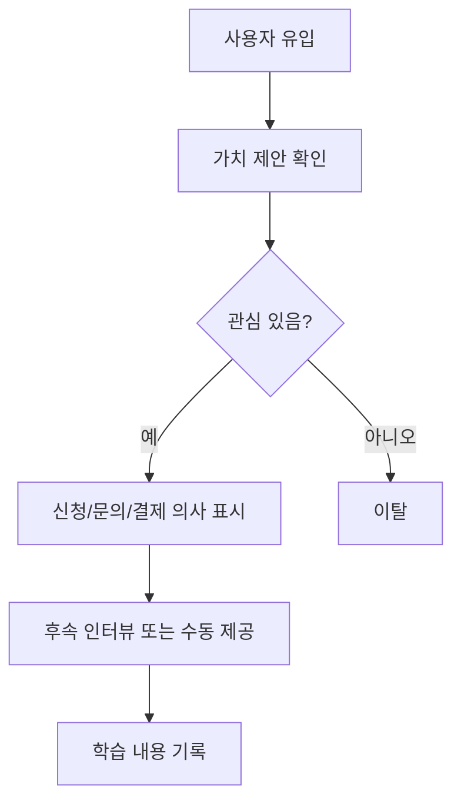

# 아이디어 프로토타입 문서

> 이 문서는 선택한 사업 아이디어를 바로 개발하지 않고, 가장 작은 형태로 사용자 반응을 확인하기 위한 프로토타입 계획서이다. 완성된 제품 설명이 아니라 "무엇을 검증하기 위해 무엇을 보여줄 것인가"를 명확히 적는다.

| 항목 | 내용 |
| --- | --- |
| **프로젝트명** | \[placeholder: 프로젝트명\] |
| **아이디어 ID** | \[placeholder: IDEA-001\] |
| **작성일** | \[placeholder: YYYY-MM-DD\] |
| **작성자** | \[placeholder: 작성자명 / 역할\] |
| **프로토타입 유형** | \[랜딩페이지 / 피그마 / 수동 운영 / 노코드 / 클릭 더미 / 문서형\] |

---

## 1. 검증 목표

| 구분 | 내용 |
| --- | --- |
| 검증할 핵심 질문 | \[placeholder: 이 아이디어에서 가장 불확실한 질문 1개\] |
| 검증하지 않을 것 | \[placeholder: 이번 단계에서 판단하지 않을 것\] |
| 대상 사용자 | \[placeholder: 누구에게 보여줄 것인가\] |
| 기대 행동 | \[placeholder: 문의 / 신청 / 결제 / 피드백 / 재방문 등\] |
| 성공 기준 | \[placeholder: 숫자로 판단 가능한 기준\] |
| 중단 기준 | \[placeholder: 언제 폐기 또는 방향 전환할 것인가\] |

---

## 2. 핵심 가치 문장

| 항목 | 내용 |
| --- | --- |
| 문제 문장 | \[placeholder: 사용자가 겪는 문제를 한 문장으로\] |
| 해결 문장 | \[placeholder: 우리가 제공하는 해결책을 한 문장으로\] |
| 결과 문장 | \[placeholder: 사용자가 얻게 되는 결과를 한 문장으로\] |
| 차별점 | \[placeholder: 기존 대안보다 나은 점\] |

---

## 3. 프로토타입 범위

### 3.1 포함 범위

| ID | 화면/기능 | 목적 | 완료 기준 |
| --- | --- | --- | --- |
| P-001 | \[placeholder: 첫 화면 / 제안 페이지\] | \[placeholder\] | \[placeholder\] |
| P-002 | \[placeholder: 신청/문의 폼\] | \[placeholder\] | \[placeholder\] |
| P-003 | \[placeholder: 결과 예시\] | \[placeholder\] | \[placeholder\] |

### 3.2 제외 범위

| 제외 항목 | 제외 이유 | 다음 검토 시점 |
| --- | --- | --- |
| \[placeholder: 로그인\] | \[placeholder: 검증에 필요 없음\] | \[placeholder\] |
| \[placeholder: 자동화\] | \[placeholder: 수동 운영으로 먼저 검증\] | \[placeholder\] |
| \[placeholder: 결제 연동\] | \[placeholder\] | \[placeholder\] |

---

## 4. 사용자 흐름

---

## 5. 실험 설계

| 항목 | 내용 |
| --- | --- |
| 유입 채널 | \[placeholder: 커뮤니티 / 지인 / 광고 / 콜드메일 / 검색 등\] |
| 노출 대상 수 | \[placeholder: n명\] |
| 측정 기간 | \[placeholder: YYYY-MM-DD ~ YYYY-MM-DD\] |
| 측정 지표 | \[placeholder: 방문수 / 클릭률 / 신청률 / 결제의향 / 인터뷰 수\] |
| 성공 기준 | \[placeholder: 예) 50명 중 5명 이상 신청\] |
| 실패 기준 | \[placeholder: 예) 신청 0명 또는 문제 공감 부족\] |

---

## 6. 피드백 기록

| 날짜 | 사용자 유형 | 반응 | 핵심 발언 | 해석 | 후속 조치 |
| --- | --- | --- | --- | --- | --- |
| \[placeholder\] | \[placeholder\] | \[긍정/중립/부정\] | \[placeholder\] | \[placeholder\] | \[placeholder\] |

---

## 7. 결정

| 결정 항목 | 내용 |
| --- | --- |
| 결과 | \[진행 / 수정 / 보류 / 폐기\] |
| 근거 | \[placeholder: 데이터와 피드백 기반 근거\] |
| 다음 단계 | \[서비스 기획서 작성 / 추가 실험 / 아이디어 재정의\] |
